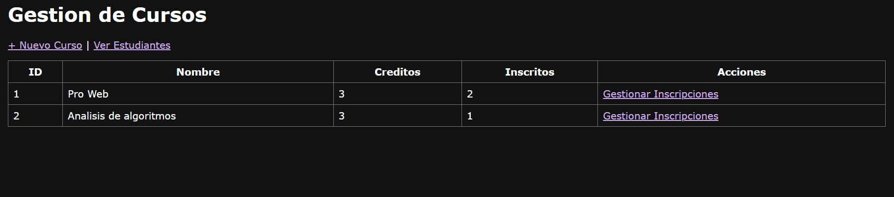
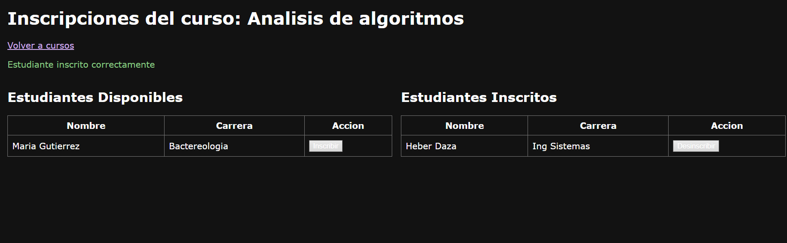
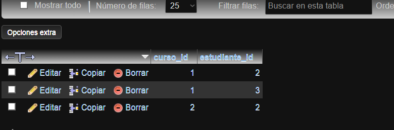

# U8 PostContenido 2 - Relacion ManyToMany Estudiantes-Cursos

Extension de U8 Post 1 con entidad `Curso` y relacion `@ManyToMany` hacia `Estudiante`.

## Requisitos
- Java 17+
- Maven 3.8+
- MySQL 8.x

## Ejecutar
```bash
mvn spring-boot:run
```

Abrir:
- `http://localhost:8080/estudiantes`
- `http://localhost:8080/cursos`

## Funcionalidades
- CRUD de estudiantes (base)
- Crear cursos
- Inscribir/desinscribir estudiantes en cursos
- Tabla intermedia `curso_estudiante` creada por JPA
- Consultas con `JOIN FETCH` para evitar N+1

## Entrega GitHub
Nombre sugerido: `apellido-post2-u8`

## Capturas de Pantalla de la Aplicación (Relación ManyToMany)

**1. Lista de Cursos con Estudiantes:**


**2. Formulario de Inscripción:**


**3. Tabla Intermedia en MySQL (curso_estudiante):**
